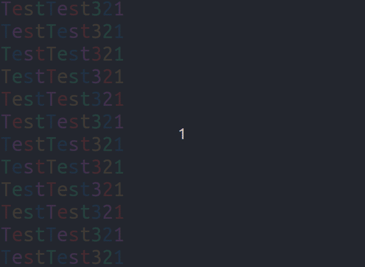

# Rainbow Printer!



## Kako koristiti
Jednostavno. Potrebno je samo pokrenut _compile.sh_ kako bi se dobio izvršni program. Nakon toga se samo pokrene "rainbow" program (npr. ```./rainbow```) i možete uživati u svom šarenom ispisu! jej!

## Kako promijeniti tekst koji se ispisuje?

### 1. Način (siguran)
Potrebno je promijeniti vrijednost lokacije na koju pokazuje labela _text_start_

        text_start:
                .ascii "TestTest321\n\0"
        text_end:
u npr.

        text_start:
                .ascii "Ovo je cool!\n\0"
        text_end:

Nakon toga je potrebno opet pokrenuti _compile.sh_ skriptu

### 2. Način (ne testiran)
Prvobitan plan je bio da korisnik unosi tekst koji želi da se ispisuje kao parametar programa. To nisam stigao još istestirat i to će biti dodano kasnije. Ali u teoriji, uz malo modifikacije bi trebalo već raditi.

Imamo dve sekcije koda koje se trebaju modificirat

    ... (iznad color_loop:)
        movl    $color, %ecx            # Adresa arraya escape sekvence
        #movl   ST_ARGV_1(%ebp), %edx   # Adresa početka glavnog teksta
        movl    $text_start, %edx
        movl    $0, %edi                # Brojač sekvence
    ...
    
    ... (u text_pointer_reset: nakon go_sleep:)
        #movl   ST_ARGV_1(%ebp), %edx   # Posstavimo ponovno pokazivač na
        movl    $text_start, %edx       # početak teksta
    ...
    
U obje sekcije koda je potrebno zamjeniti ```movl    $text_start, %edx``` sa ```movl   ST_ARGV_1(%ebp), %edx```. To će napravit da program koristi prvi parametar programa kao glavni tekstualni pokazivač umjesto ```text_start:``` labele.

Nakon modifikacije koda, te sekcije bi trebale izgledati ovako:

    ... (iznad color_loop:)
        movl    $color, %ecx            # Adresa arraya escape sekvence
        movl   ST_ARGV_1(%ebp), %edx   # Adresa početka glavnog teksta
        #movl    $text_start, %edx
        movl    $0, %edi                # Brojač sekvence
    ...

    ... (u text_pointer_reset: nakon go_sleep:)
        movl   ST_ARGV_1(%ebp), %edx   # Posstavimo ponovno pokazivač na
        #movl    $text_start, %edx       # početak teksta
    ...

Nako toga, ponovno pokrenite _compile.sh_ skriptu i pokrenite program sa sljedećom naredbom ```./rainbow testtext```. Program bi nakon toga trebao koristit "_testtext_" kao glavni tekst za ispis!
